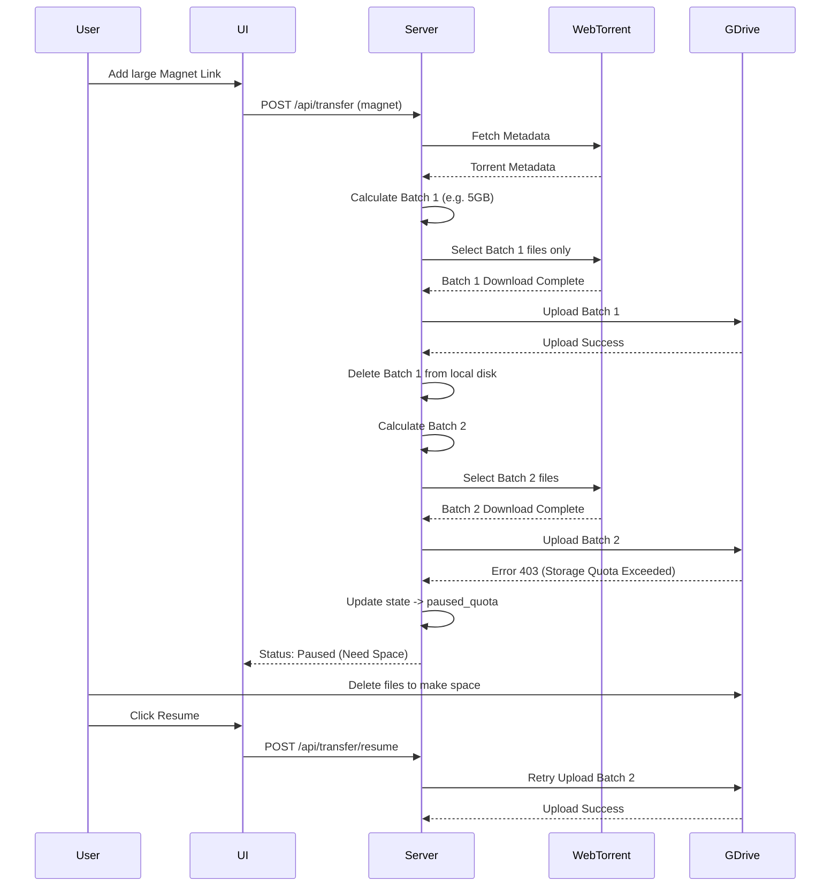

# Design

## 1. Architecture Overview
To support large torrents that exceed VPS and Google Drive storage limits, the download pipeline will be enhanced with a **State Manager** and a **Batch Processor**.

- **State Manager (JSON Store):** A new module (`server/services/store.js`) will persist transfer states to disk (e.g., `data/transfers.json`). This ensures that downloads survive server restarts and allows the frontend to poll the active state across sessions.
- **Batch Processor:** Instead of downloading the entire torrent at once, WebTorrent will be instructed to select files in batches (e.g., up to 5GB per batch).
- **Upload & Cleanup:** Once a batch is downloaded, it is uploaded to Google Drive. The local files are then deleted, freeing up VPS space for the next batch.
- **Quota Handling:** If Google Drive returns a quota error (403), the torrent state is changed to `paused_quota`. The user can later trigger a `resume` action from the UI.

## 2. Data Models

**Transfer State (`data/transfers.json`):**
```json
{
  "transfers": {
    "torrent_12345": {
      "id": "torrent_12345",
      "type": "torrent",
      "url": "magnet:?xt=urn:btih:...",
      "name": "Ubuntu 22.04 LTS",
      "status": "downloading", // downloading, uploading, paused_quota, completed, error
      "totalBytes": 15000000000,
      "downloadedBytes": 0,
      "uploadedBytes": 0,
      "completedFiles": ["file1.iso", "file2.txt"]
    }
  }
}
```

## 3. Workflows



## 4. UI Modifications
- Update `dashboard.js` to fetch and display active transfers on load.
- Add "Resume" button for paused transfers.
- Show overall progress based on the persisted state rather than a single session SSE.
