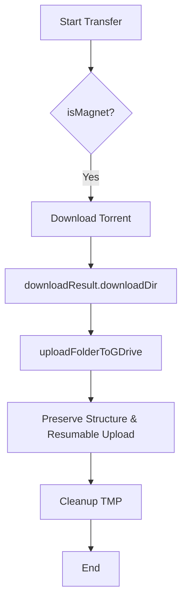

# Design: Torrent Upload Reliability & Structure Preservation

## Architecture

The solution involves modifying the Google Drive service to support recursive folder uploads and more robust transmission protocols.

### 1. Recursive Folder Mapping
To preserve the directory structure on Google Drive:
- We will implement a recursive upload function that maps local paths to Drive folder IDs.
- A `Map<string, string>` will be used to cache `localPath -> driveFolderId` to avoid repeated `files.list` or `files.create` calls for the same directory.

### 2. Resumable Upload Implementation
- We will switch from `multipart` uploads to `resumable` uploads in `googleapis`.
- This is done by setting `uploadType: 'resumable'` in the media parameters.
- This allows the library to handle chunked transmission and retry on certain errors automatically.

### 3. Startup Cleanup
- A utility function `clearTmp()` will be added to `downloader.js`.
- It will use `rmSync(TMP_DIR, { recursive: true, force: true })` followed by `mkdirSync`.
- This will be called in `server/index.js` before `app.listen`.

## Data Models & Logic

### Folder Upload Logic (Pseudocode)
```javascript
async function uploadFolder(localDirPath, parentDriveId) {
  const files = getAllFilesRecursive(localDirPath);
  const folderCache = { '': parentDriveId };

  for (const file of files) {
    const relativePath = path.relative(localDirPath, file);
    const parts = relativePath.split(path.sep);
    const fileName = parts.pop();
    
    // Ensure all parent directories exist on Drive
    let currentParentId = parentDriveId;
    let pathAcc = "";
    for (const part of parts) {
      pathAcc = path.join(pathAcc, part);
      if (!folderCache[pathAcc]) {
        folderCache[pathAcc] = await findOrCreateFolder(drive, part, currentParentId);
      }
      currentParentId = folderCache[pathAcc];
    }

    await uploadFileToDrive(file, fileName, currentParentId, { resumable: true });
  }
}
```

## Diagrams


