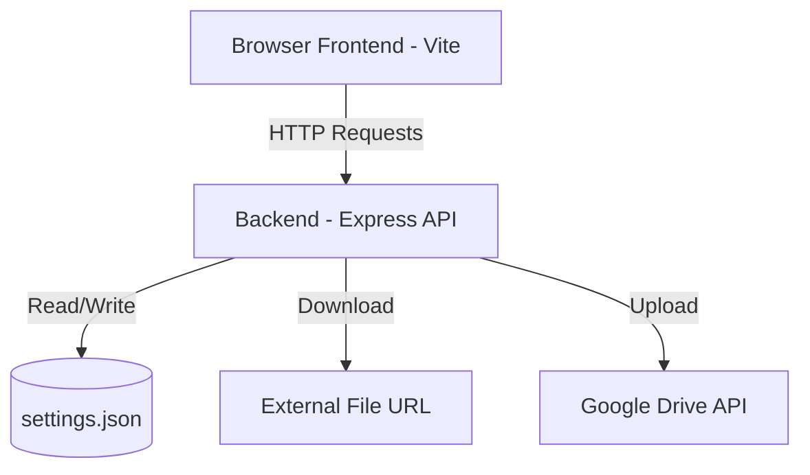
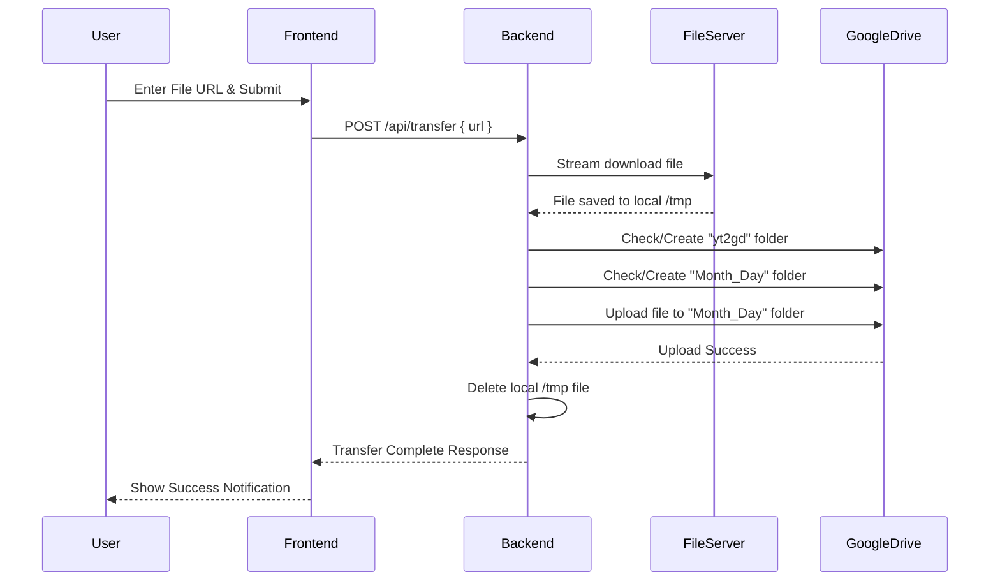

# yt2gd - Design Document

## 1. Technology Stack
- **Frontend Framework**: Vite, Vanilla CSS/HTML/JS (or Vue/React if preferred).
- **Backend Framework**: Node.js with Express.js to serve the Vite frontend and handle the backend API operations.
- **Authentication**: Simple session-based or token-based authentication using the configured password.
- **Google Drive Integration**: Official `googleapis` npm package.
- **File Downloading**: Native `https`/`http` modules or lightweight HTTP client like `axios` to stream files to local disk to support large files without consuming too much memory.

## 2. Data Models
### Settings Model (Stored locally in `settings.json`)
```json
{
  "passwordHash": "bcrypt_hashed_password_for_login",
  "googleDrive": {
    "clientId": "string",
    "clientSecret": "string",
    "redirectUri": "string",
    "refreshToken": "string"
  }
}
```

## 3. Architecture Diagrams

### System Architecture


### URL to Google Drive Flow

