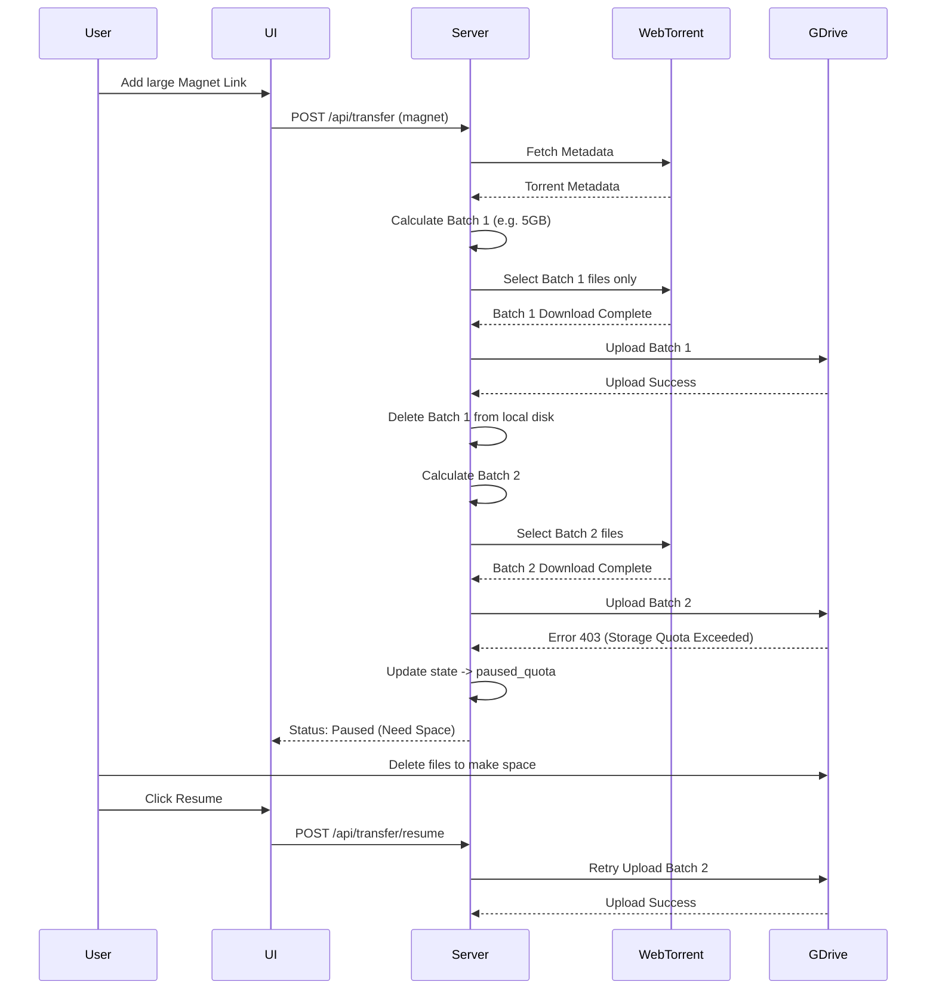
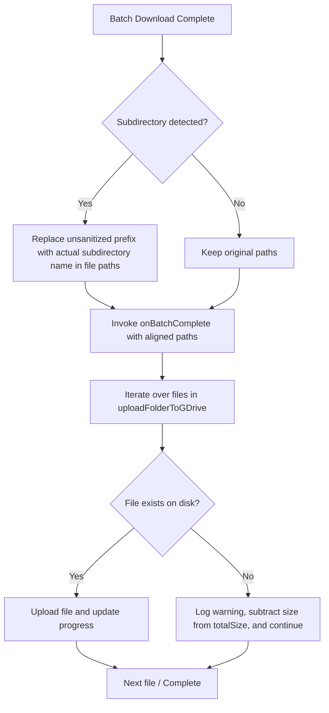

# Design

## 1. Architecture Overview
To support large torrents that exceed VPS and Google Drive storage limits, the download pipeline will be enhanced with a **State Manager** and a **Batch Processor**.

- **State Manager (JSON Store):** A new module (`server/services/store.js`) will persist transfer states to disk (e.g., `data/transfers.json`). This ensures that downloads survive server restarts and allows the frontend to poll the active state across sessions.
- **Batch Processor:** Instead of downloading the entire torrent at once, WebTorrent will be instructed to select files in batches (e.g., up to 5GB per batch).
- **Upload & Cleanup:** Once a batch is downloaded, it is uploaded to Google Drive. The local files are then deleted, freeing up VPS space for the next batch.
- **Quota Handling:** If Google Drive returns a quota error (403), the torrent state is changed to `paused_quota`. The user can later trigger a `resume` action from the UI.

## 2. Data Models

**Transfer State (`data/transfers.json`):**
```json
{
  "transfers": {
    "torrent_12345": {
      "id": "torrent_12345",
      "type": "torrent",
      "url": "magnet:?xt=urn:btih:...",
      "name": "Ubuntu 22.04 LTS",
      "status": "downloading", // downloading, uploading, paused_quota, completed, error
      "totalBytes": 15000000000,
      "downloadedBytes": 0,
      "uploadedBytes": 0,
      "completedFiles": ["file1.iso", "file2.txt"]
    }
  }
}
```

## 3. Workflows



## 4. UI Modifications
- Update `dashboard.js` to fetch and display active transfers on load.
- Add "Resume" button for paused transfers.
- Show overall progress based on the persisted state rather than a single session SSE.
- Update `settings.js` to display the current `yt-dlp` version and a button to trigger an update.

## 5. yt-dlp Update Mechanism
- **API Endpoints:**
  - `GET /api/system/ytdlp-version`: Executes `yt-dlp --version` to return the currently installed version.
  - `POST /api/system/update-ytdlp`: Executes `node scripts/download-yt-dlp.js --force` to download the latest nightly build.
- **Background Task:** In `server/index.js`, a `setInterval` runs every 24 hours (86,400,000 ms) to automatically execute the update script.

## 6. App Update & Rollback Mechanism
- **API Endpoints:**
  - `GET /api/system/commits`: Runs `git log -5 --pretty=format:"%H|%h|%s|%cr|%d"` to retrieve the last 5 commits, including their full and short hashes, message subject, relative date, and git references (to check which is active).
  - `POST /api/system/update-app`: Runs a command sequence:
    1. `git reset --hard` (drops local changes for a clean pull)
    2. `git pull`
    3. `npm install`
    4. `npm run build:client`
    5. Triggers a delayed `process.exit(0)` to let PM2 restart the server.
  - `POST /api/system/rollback-app`: Receives `{ hash }` and runs:
    1. `git reset --hard`
    2. `git checkout <hash>`
    3. `npm install`
    4. `npm run build:client`
    5. Triggers a delayed `process.exit(0)` to let PM2 restart the server.
- **UI Element**: Add a "System Management" card in the settings view showing the commit history, active commit indicator, update button, and rollback button.

## 7. Resilient Playlist Downloading Design
- **Conditional Playlist Support:** In `downloader.js`, the system detects if the YouTube URL is a playlist by checking for `list=` parameter. If detected:
  - `noPlaylist` option is set to `false`.
  - `ignoreErrors` option is set to `true` to instruct `yt-dlp` to skip over unavailable, private, or deleted videos.
- **Robust Exception Interception:** If `youtube-dl-exec` exits with a non-zero code due to skipped videos, the system intercepts the exception:
  - Checks if any files starting with the custom session `baseName` exist in `TMP_DIR`.
  - If files are found, the error is treated as non-fatal, logged to the console, and execution proceeds to folder organization and Google Drive upload.
  - If no files exist, the error is rethrown to fail gracefully.

## 8. Manual Stranded File Upload Design
- **API Wrapper (`client/src/api.js`):** Add `uploadFiles` to call `POST /api/system/upload-files` with `{ targetName }`.
- **System Status UI Integration (`client/src/views/dashboard.js`):**
  - Rewrite `refreshSystemStatus` to render each file/folder inside `tmpItems` using the premium `.history-item` card style.
  - Append an "Upload" button next to each stranded file or folder.
  - Bind dynamic click handlers that disable the button, call `api.uploadFiles`, alert the user upon completion, and refresh the system status view.

## 9. Torrent Batch Upload Path Alignment & Skipping Design
- **Path Mapping Alignment:** In `downloader.js`, the first path segment of the files in `batch.files` (which represents the original unsanitized torrent name) will be replaced with `foundDirName` (the actual sanitized folder name detected on disk) so that the correct absolute paths are passed to `uploadFolderToGDrive`.
- **Exist Check and Skip in GDrive Upload:** In `uploadFolderToGDrive` (`server/services/gdrive.js`), before attempting to stat and upload a file from `specificFiles`, the system will perform an `existsSync` check. If the file is missing:
  - The system will log a warning and skip the file using `continue`.
  - The system will subtract the file's size from `totalSize` to keep the progress percentage accurate.
- **Robustness Workflow:**


## 10. Safe WebTorrent Client Destruction Design
- **Safe Client Destruction Helper:** In `downloader.js`, we will implement a helper function `safeDestroy` within the `downloadTorrent` scope.
- **Verification and Call:** `safeDestroy` will check if `client` is defined and if `client.destroyed` is false before invoking `client.destroy()`. It will also be wrapped in a try-catch block to suppress any unexpected WebTorrent internal exceptions.
- **Global Replacement:** All direct calls to `client.destroy()` inside `downloadTorrent` will be replaced with `safeDestroy()`.

