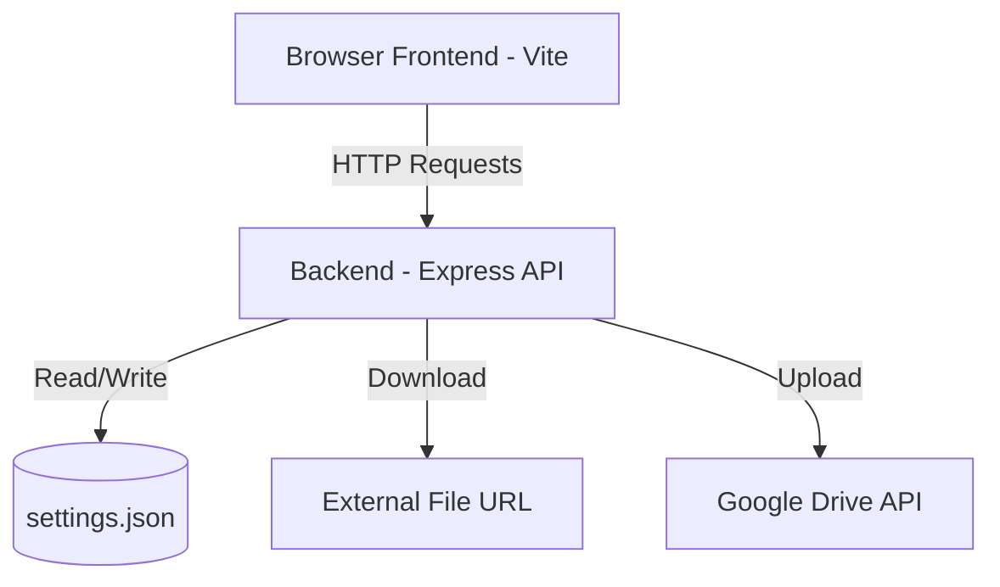
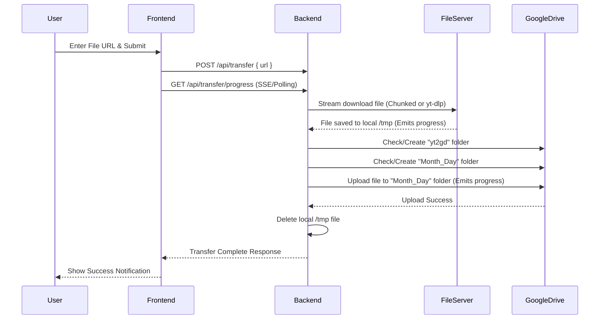

# yt2gd - Design Document

## 1. Technology Stack
- **Frontend Framework**: Vite, Vanilla CSS/HTML/JS (or Vue/React if preferred).
- **Backend Framework**: Node.js with Express.js to serve the Vite frontend and handle the backend API operations.
- **Authentication**: Simple session-based or token-based authentication using the configured password.
- **Google Drive Integration**: Official `googleapis` npm package.
- **File Downloading**: 
  - **Direct/Raw URLs**: A dedicated Node.js downloader library (e.g., `node-downloader-helper` or `multi-part-downloader`) configured for concurrent multi-part downloading to handle large 1GB+ files efficiently without custom manual chunk merging.
  - **YouTube URLs**: Integration with `yt-dlp` executable (via a wrapper like `youtube-dl-exec`). The binary will be downloaded automatically via a custom script (`scripts/download-yt-dlp.js`) for the correct OS and ignored in `.gitignore`.
- **Real-Time Progress**: Server-Sent Events (SSE) or a polling endpoint to send download/upload progress (bytes, total, speed) to the frontend.
- **Versioning**: The server exposes its version from `package.json`. The Vite frontend embeds the version using `import.meta.env.VITE_APP_VERSION`.

## 2. Data Models
### Settings Model (Stored locally in `settings.json`)
```json
{
  "passwordHash": "bcrypt_hashed_password_for_login",
  "googleDrive": {
    "clientId": "string",
    "clientSecret": "string",
    "redirectUri": "string",
    "refreshToken": "string"
  }
}
```

## 3. Architecture Diagrams

### System Architecture


### URL to Google Drive Flow

