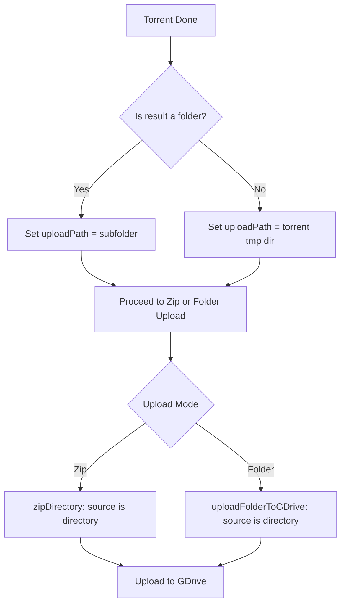

# Design: Fix ENOTDIR in Torrent Uploads

## Tech Stack
- No changes to the existing tech stack (WebTorrent, Archiver, Google Drive API).

## Proposed Changes

### 1. Downloader Service (`server/services/downloader.js`)
- **`downloadTorrent`**: Update the completion logic to ensure `uploadPath` is always a directory. If the torrent result is a single file, `uploadPath` should be set to the `downloadDir` (the temporary torrent-specific folder) instead of the file path itself.
- **`zipDirectory`**: Add a check to see if the source is a file. If it is, use `archive.file()` instead of `archive.directory()`.

### 2. GDrive Service (`server/services/gdrive.js`)
- **`getAllFiles`**: Add a defensive check. If the input path is a file, return it as a single-item array instead of calling `readdir`.
- **`uploadFolderToGDrive`**: Ensure that when a single file is being uploaded via this method (e.g., from a single-file torrent), the relative path calculation handles the case where `dirPath` is the same as `filePath`.

## Data Flow Diagram

