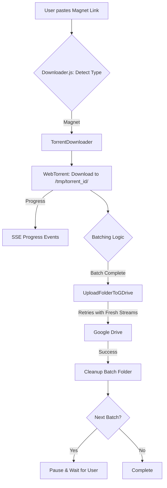

# Torrent Support Design

## Tech Stack
- **Torrent Client**: `webtorrent`
- **Compression**: `archiver`
- **File System**: `fs/promises` for cleanup
- **Uploads**: `googleapis` (Drive v3)

## Data Flow

## Backend Changes

### Downloader Service (`server/services/downloader.js`)
- **[UPDATE]** Improve directory detection after download to handle WebTorrent's automatic sanitization of folder names.
- **[FIX]** Ensure `onBatchComplete` is called with absolute paths that correctly map to the disk structure.

### Google Drive Service (`server/services/gdrive.js`)
- **[UPDATE]** `withRetry` helper: Enhance to support factory functions for stream recreation.
- **[FIX]** `uploadToGDrive` and `uploadFolderToGDrive`: Recreate the `ReadStream` and `progress-stream` inside the retry logic to ensure each attempt starts from byte 0.
- **[UPDATE]** Add more specific error handling for transient vs permanent failures.

### Transfer Route (`server/routes/transfer.js`)
- **[UPDATE]** Improve error reporting for batch uploads to distinguish between quota issues and general failures.

## Frontend Changes

### Dashboard View (`client/src/views/dashboard.js`)
- **[NEW]** Add a "Start Batch Index" input in the Torrent Options section (already implemented, but ensure it's robust).
- **[UPDATE]** Better error messages for "partial" batch completion.
