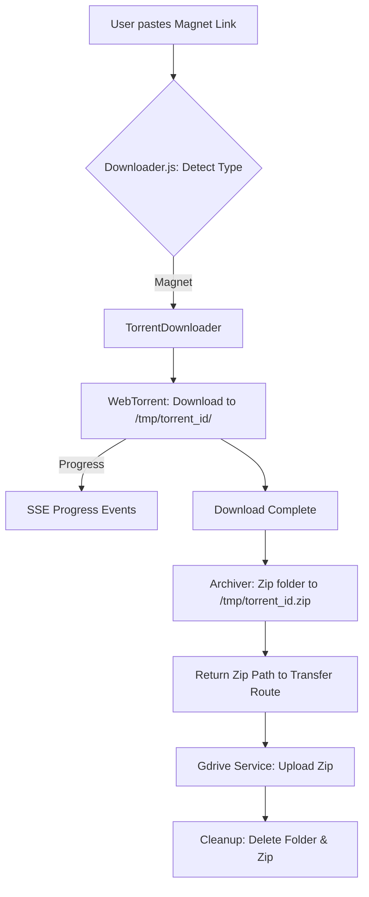

# Torrent Support Design

## Tech Stack
- **Torrent Client**: `webtorrent`
- **Compression**: `archiver`
- **File System**: `fs/promises` for cleanup

## Data Flow

## Backend Changes

### Downloader Service (`server/services/downloader.js`)
- Add `isMagnet(url)` utility.
- Implement `downloadTorrent(url, onProgress, abortSignal)`:
    - Creates a unique subfolder in `TMP_DIR`.
    - Initializes `WebTorrent` client.
    - Tracks `downloaded`, `total`, `downloadSpeed`, and `numPeers`.
    - Returns the final ZIP path.
- Implement `zipDirectory(sourceDir, outPath)` helper using `archiver`.

### Transfer Route (`server/routes/transfer.js`)
- Update the cleanup block to handle directory removal if the source was a torrent.
- Update progress labels to show peer count for torrents.

## Frontend Changes

### Dashboard View (`client/src/views/dashboard.js`)
- Update `isYouTubeUrl` logic to also include `isMagnetUrl`.
- Update UI to show a "Torrent" indicator when a magnet link is detected.
- Enhance progress display to show "Peers" when downloading a torrent.
