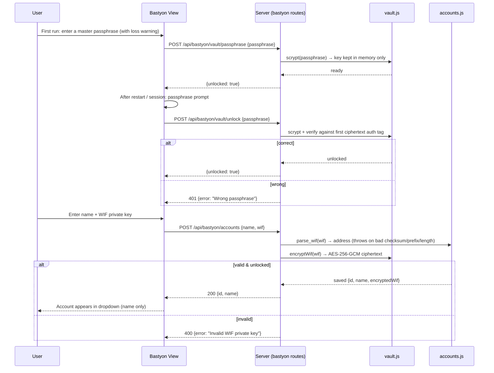
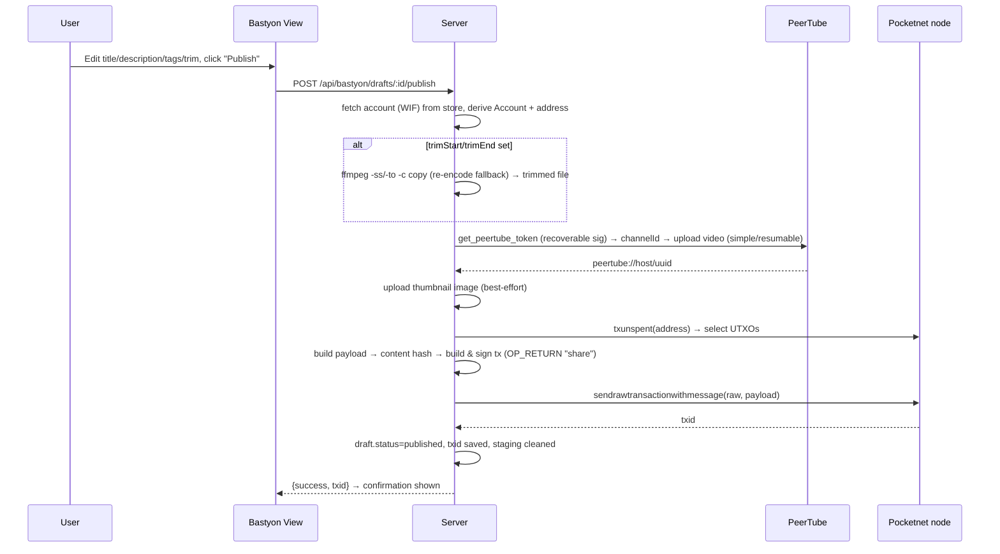

# Design — Bastyon Uploader Integration

## 1. Architecture Overview

The app is a Node.js (Express) server with a vanilla-JS client (Vite). Bastyon support will be added as a **server-side service layer** (a faithful JS port of `bastyon-poster-linux`) plus a **new client view**. No Python runtime is required on the VPS.

```
client/src/views/bastyon.js        ← new tab UI (accounts, download, draft editor, publish)
client/src/api.js                  ← + bastyon API wrappers + SSE stream
client/src/main.js                 ← + 'bastyon' route
client/src/views/dashboard.js,
client/src/views/settings.js       ← + nav item (Dashboard | Bastyon Uploader | Settings)

server/routes/bastyon.js           ← REST + SSE endpoints (auth-protected)
server/services/bastyon/            ← ported logic from bastyon-poster-linux
  constants.js                       Network params (mainnet/testnet), fee/dust/payload limits
  crypto.js                          Base58Check, WIF parse, pubkey/address, ECDSA sign
  payload.js                         PostPayload, content hash, serialization
  transaction.js                     varint/pushdata, OP_RETURN + P2PKH, sighash, sign
  rpc.js                             JSON-RPC client (txunspent, sendrawtransactionwithmessage)
  media.js                           PeerTube token/channel/simple/resumable upload, image upload
  accounts.js                        Account store (name + WIF) in data/bastyon-accounts.json
  drafts.js                          Draft post store in data/bastyon-drafts.json
server/services/downloader.js      ← app-wide yt-dlp coverage (detection change + metadata mode)
```

### 1.1 Why port instead of shelling out to Python
- Single runtime on the VPS: no Python 3.10+, `coincurve`, `requests` installs to manage.
- The Python crypto is well-tested; we port it **1:1** and verify with the same test vectors (REQ-BOR-2), so behavior is preserved.
- Node 22's built-in `crypto` provides SHA-256 and RIPEMD-160; `secp256k1` ECDSA is provided by a single small pure-JS dependency (`@noble/curves`), which also supplies recoverable signatures for PeerTube blockchain auth.

## 2. Dependencies

| Package | Why | Notes |
| :--- | :--- | :--- |
| `@noble/curves` | secp256k1 ECDSA (DER + compact recoverable), pubkey derivation | Pure JS, audited; replaces `coincurve` |

Everything else (axios for HTTP, Node `crypto` for hashing, `youtube-dl-exec` for yt-dlp) is already used by the project.

## 3. Data Models

### 3.1 Bastyon Account — `data/bastyon-accounts.json`
```json
{
  "accounts": [
    {
      "id": "acc_1723…",
      "name": "MyChannel",
      "encryptedWif": {          // AES-256-GCM; the plaintext key NEVER touches disk
        "salt": "…",             // 16-byte random, per account (scrypt input)
        "iv": "…",               // 12-byte random
        "tag": "…",              // 16-byte GCM auth tag
        "ciphertext": "…"        // base64
      },
      "address": "P…",           // derived at creation; server-side only
      "createdAt": 1723…
    }
  ]
}
```

The master passphrase is **never stored** — the scrypt-derived AES key lives in a module-level variable in `vault.js` (server memory only) and is cleared on restart/lock.

### 3.2 Draft Post — `data/bastyon-drafts.json`
```json
{
  "drafts": [
    {
      "id": "draft_1723…",
      "status": "draft",          // downloading | draft | publishing | published | failed
      "sourceUrl": "https://…",
      "accountId": "acc_…",
      "accountName": "MyChannel",
      "title": "…",               // pre-filled from yt-dlp metadata, editable
      "description": "…",         // pre-filled, editable
      "tags": ["…"],              // pre-filled, editable
      "thumbnailUrl": "https://…",
      "trimStart": "",            // optional, e.g. "01:30" — applied at publish
      "trimEnd": "",              // optional, e.g. "02:45"
      "filePath": "data/bastyon-staging/draft_…/video.mp4",
      "fileSize": 123456789,
      "txid": "",                 // set on success
      "error": "",
      "createdAt": 1723…,
      "updatedAt": 1723…
    }
  ]
}
```

### 3.3 Staging directory — `data/bastyon-staging/<draftId>/`
Downloaded videos and thumbnails live here (NOT `tmp/`, so Dashboard's "Clear Tmp" can't destroy pending drafts; `data/` is already git-ignored and nodemon-ignored). Cleaned up on publish or draft deletion.

## 4. Porting Map (bastyon-poster-linux → this repo)

| Python module | JS module | Key behavior preserved |
| :--- | :--- | :--- |
| `constants.py` | `bastyon/constants.js` | Mainnet (prefix 55, WIF 33, nodes `1..6.pocketnet.app:8899`) / Testnet (prefix 65, WIF 30); `DUST_THRESHOLD=700`, `DEFAULT_FEE=1000`, `MAX_PAYLOAD_SIZE=60000` |
| `crypto.py` | `bastyon/crypto.js` | Base58 encode/decode, Base58Check, `parse_wif`, `derive_pubkey` (compressed), `pubkey_to_address`, `hash256`, `hash160`, DER sign (`sign_digest`), **plus** `sign_recoverable_compact` for PeerTube auth |
| `payload.py` | `bastyon/payload.js` | `PostPayload`, `compute_content_hash` (`url+caption+message+tags+images`), `serialize_payload` (`m/l/c/t/i/u/s`), 60 KB limit |
| `transaction.py` | `bastyon/transaction.js` | varint, pushdata, `build_op_return_script`, `build_p2pkh_script`, `select_utxos`, v2 tx with `ntime`, legacy sighash, `compute_txid`, `build_and_sign_post_transaction` |
| `rpc.py` | `bastyon/rpc.js` | `POST {node}/rpc/{method}` with `{method, parameters}`; `txunspent`, `sendrawtransactionwithmessage`; node fallback + error taxonomy (mempool, not-registered, limit-exceeded, deserialization) |
| `media.py` | `bastyon/media.js` | `get_peertube_token` (nonce + recoverable sig), `get_peertube_channel_id`, simple upload ≤50 MB, resumable chunked upload >50 MB (1 MB chunks, GET-range resync), `upload_image` (bastyon.com:8092 → node fallback), host fallback list |
| `config.py` | `bastyon/accounts.js` | Name→WIF mapping, but stored in `data/bastyon-accounts.json` instead of `.env` |
| `yt_downloader.py` | extension of `server/services/downloader.js` | `--print-json` metadata extraction, output template, cookies |
| `video_edit.py` | `server/services/bastyon/trim.js` | `trim_video` (ffmpeg `-ss`/`-to` stream-copy, re-encode fallback), `parse_time_to_seconds` |
| — (new) | `server/services/bastyon/vault.js` | Passphrase vault: scrypt key derivation + AES-256-GCM encrypt/decrypt, in-memory unlock, rotation re-encryption |
| `tinnitus-sound-therapy` `audioFormatSelector` | `server/services/downloader.js` `buildFormatSelector` | Original-track default, `[language^=code]`, `[format_id!*=drc]`, `bestaudio` fallback chain |

## 5. App-Wide yt-dlp Coverage (downloader.js)

Current behavior: yt-dlp only for YouTube pages; everything else → `ParallelDownloader` (raw URL fetch). New URL classification in `downloadFile`:

```
magnet:?…                → WebTorrent (unchanged)
direct file URL          → ParallelDownloader (unchanged)
   (pathname has a media/file extension, googlevideo/videoplayback stream,
    or HEAD returns a media Content-Type)
anything else            → yt-dlp (all supported extractors) with the same
                           cookies/format/quality/live options; on
                           "Unsupported URL" error → fall back to ParallelDownloader
```

- YouTube options (format/quality/live) remain for YouTube; for other sites the format selector is passed best-effort (yt-dlp ignores incompatible selectors gracefully).
- New exported helper `downloadWithMetadata(url, options)` used by the Bastyon flow: runs yt-dlp with `printJson: true`, parses the JSON line, returns `{ filePath, title, description, tags, thumbnail, originalUrl }`. Reuses the existing yt-dlp binary resolution (`bin/yt-dlp`), cookies filtering (`filterCookies`), and progress piping.

### 5.1 Audio Track Selection & Auto-Dub Fix (learned from `tinnitus-sound-therapy`)

YouTube's auto-dub feature makes plain `bestaudio` land on a region-pre-selected dubbed track. The fix, proven in the tinnitus project, has two parts and is applied **app-wide** (Dashboard + Bastyon Uploader):

1. **Sort by language preference** — every yt-dlp invocation gets `formatSort: ['lang']` (`-S lang`). The extractor assigns the original track the highest `language_preference` and dubbed/auto-dubbed tracks lower/negative values, so `bestaudio`/merged audio always picks the original track by default.
2. **Format selector builder** `buildFormatSelector({ format, quality, audioLanguage })` in `downloader.js`, mirroring the tinnitus `audioFormatSelector` chain (with the m4a preference retained since merged MP4 output wants AAC):
   ```
   lang = ORIGINAL   → bestaudio[ext=m4a][format_id!*=drc]/bestaudio[format_id!*=drc]/bestaudio
   lang = "en"       → bestaudio[ext=m4a][language^=en][format_id!*=drc]
                       /bestaudio[language^=en][format_id!*=drc]
                       /bestaudio[language^=en]               ← wanted lang exists, no abr cap
                       /bestaudio[ext=m4a][format_id!*=drc]    ← original-track fallback
                       /bestaudio[format_id!*=drc]
                       /bestaudio
   ```
   The `[language^=code]` prefix filter (e.g. `en` also catches `en-US`) restricts to the requested track; the trailing `bestaudio` fallback guarantees a download never fails on format grounds.
3. **Composition with video quality** (kept identical to today's behavior):
   - audio only → `<audioSelector>`
   - video best → `bestvideo+<audioSelector>/best`
   - video height N → `bestvideo[height<=N]+<audioSelector>/best[height<=N]`
   - live → existing `liveFromStart` options unchanged.

The Dashboard's existing format/quality selects stay; a new **Audio Track** dropdown (Original, English, Farsi, Arabic, Turkish, French, German, Spanish, Portuguese, Russian, Hindi, Japanese, Korean — the same list as the tinnitus app) is added next to them, and to the Bastyon Uploader's download card. `audioLanguage` is passed through the API into `downloadFile` / `downloadWithMetadata`.

## 6. API Surface (`server/routes/bastyon.js`)

All routes require auth (same `requireAuth` middleware). Progress streams use a **separate** SSE endpoint so Bastyon events can't be misread by the Dashboard's transfer listener.

| Method | Path | Purpose |
| :--- | :--- | :--- |
| GET | `/api/bastyon/accounts` | List accounts → `[{ id, name, createdAt, encrypted: true }]` (never WIF) |
| POST | `/api/bastyon/accounts` | `{ name, wif }` (vault must be unlocked) → validate WIF, derive address, encrypt, store; errors: invalid WIF / duplicate name / vault locked |
| DELETE | `/api/bastyon/accounts/:id` | Remove account (no decryption needed) |
| GET | `/api/bastyon/vault/status` | `{ hasAccounts, unlocked }` |
| POST | `/api/bastyon/vault/unlock` | `{ passphrase }` → derive key, hold in memory; wrong passphrase → 401 (GCM auth-tag failure) |
| POST | `/api/bastyon/vault/lock` | Clear the in-memory key |
| POST | `/api/bastyon/vault/passphrase` | `{ passphrase }` → set on first use, or rotate (re-encrypt all accounts) when unlocked |
| POST | `/api/bastyon/download` | `{ url, accountId, format?, quality?, audioLanguage? }` → async yt-dlp download (SSE progress) → creates draft; returns draft |
| GET | `/api/bastyon/drafts` | List drafts |
| GET | `/api/bastyon/drafts/:id` | Single draft |
| PUT | `/api/bastyon/drafts/:id` | `{ title, description, tags, accountId, trimStart, trimEnd }` → update editable fields |
| DELETE | `/api/bastyon/drafts/:id` | Delete draft + staging files |
| POST | `/api/bastyon/drafts/:id/publish` | trim (if set) → PeerTube upload → payload → sign → broadcast (SSE progress) → `{ txid }` |
| GET | `/api/bastyon/progress` | SSE stream (per-session, mirrors `/api/transfer/progress` pattern) |
| GET | `/api/bastyon/storage` | `{ disk: { total, free, used }, staging: { path, size, files: [{ name, size }] } }` — drives the storage indicator |
| POST | `/api/bastyon/staging/clear` | Confirmation-gated: wipe `data/bastyon-staging/` and remove non-published drafts |

Publish is transactional in the sense that any failure leaves the draft editable with the file intact (REQ-PUB-7).

## 7. Workflows

### 7.1 Set passphrase, unlock, add account


### 7.2 Download → Draft
```mermaid
sequenceDiagram
    participant U as User
    participant UI as Bastyon View
    participant S as Server
    participant D as downloader.js
    participant C as cookies (data/)
    U->>UI: Paste URL, pick account, click "Download & Create Post"
    UI->>S: POST /api/bastyon/download
    S->>S: open SSE stream (draftId-tagged events)
    S->>D: downloadWithMetadata(url, {cookies: filterCookies(settings.cookiesPath)})
    D-->>S: {filePath, title, description, tags, thumbnail, originalUrl}
    S->>S: move file to data/bastyon-staging/<draftId>/; create draft
    S-->>UI: {draft} → editor opens
```

### 7.3 Edit & Publish


### 7.4 Clear Staging & Storage Indicator
```mermaid
sequenceDiagram
    participant U as User
    participant UI as Bastyon View
    participant S as Server
    U->>UI: Open Bastyon Uploader
    UI->>S: GET /api/bastyon/storage (on load + poll)
    S-->>UI: {disk, staging} → disk bar + staging size rendered
    U->>UI: Click "Clear Staging"
    UI->>UI: confirm("Delete N unfinished draft(s) and their files?")
    UI->>S: POST /api/bastyon/staging/clear
    S->>S: rm -rf staging dir; drop non-published drafts
    S-->>UI: {cleared, removedDrafts} → UI refreshes drafts + indicator
```

## 8. UI Design (client/src/views/bastyon.js)

Follows the existing view structure (sidebar + cards, `fade-up` animations, `.form-control`, `.btn`, `.alert`, `.badge` classes from `style.css`). Sections, top to bottom:

1. **Publish Card** — account dropdown (names only) · URL input · format (video/audio) & quality selects (same options as Dashboard) · **Audio Track dropdown** (Original + 12 languages, default Original) · "Download & Create Post" button · SSE progress bar (reuses the progress markup pattern from the Dashboard).
2. **Draft Editor Card** (visible when a draft is selected) — title, description (textarea), tags (comma-separated), account selector (editable), **Trim Start / Trim End inputs** (optional, `SS`/`MM:SS`/`HH:MM:SS`), "Save Changes" / "Publish to Bastyon" / "Delete Draft" buttons; publish progress area; success alert showing the TxID; error alert with retry.
3. **Drafts List Card** — persisted drafts with status badges (Draft / Publishing… / Published ✓ / Failed), editable via click; "New Post" button to clear the editor.
4. **Storage Card** — mirrors the Dashboard's System Status widget: color-coded disk usage bar (used/total/percent) plus the Bastyon staging directory size and a **Clear Staging** button (confirmation-gated).
5. **Accounts Card** — add-account form (name + password-type WIF input, "Add Account") and the list of stored accounts with a delete button; the WIF is never rendered. Includes the **vault controls**: a "Set Master Passphrase" form on first use (with an unrecoverable-keys warning), an "Unlock" prompt when locked (shown automatically when a publish/account-add is attempted), an "Unlock/Lock" status chip (🔒 Locked / 🔓 Unlocked), and a "Change Passphrase" action (requires unlock; re-encrypts all keys).

Sidebar additions also include an **Audio Track** dropdown on the Dashboard's YouTube options row (next to Format/Quality) so the auto-dub fix applies to every Dashboard download, not just Bastyon posts.

Sidebar changes: add `Bastyon Uploader` (`id="nav-bastyon"`) between Dashboard and Settings in `dashboard.js`, `settings.js`, and the new `bastyon.js`; add the `bastyon` case to `navigate()` in `main.js`; add API wrappers + `openBastyonProgressStream()` in `api.js`.

## 9. Error Taxonomy (mapped from rpc.py)

| Condition | User-facing message |
| :--- | :--- |
| No confirmed UTXOs / insufficient balance | "No spendable funds found for this account (needs a small PKOIN balance)." |
| Account not registered on-chain | "This account is not registered on the Bastyon blockchain (ACCOUNT_USER required)." |
| Daily posting limit | "Daily posting limit reached for this account." |
| All PeerTube hosts fail | Aggregated host errors, draft kept editable |
| yt-dlp unsupported URL | "This URL is not supported by yt-dlp." (Dashboard falls back to direct download) |

## 10. Security Notes

- **WIF keys at rest**: AES-256-GCM ciphertext only, in `data/bastyon-accounts.json` (git-ignored). The master passphrase is never persisted; the derived key lives in server memory and is cleared on restart or explicit lock. GCM authentication means a wrong passphrase is detected (auth-tag mismatch) rather than returning garbage.
- **In-transit & in-use**: WIF plaintext exists only inside a single server request scope while publishing (decrypt → sign → discard), never returned by any API, never logged.
- All `/api/bastyon/*` routes are behind `requireAuth`.
- Staging paths are constructed from server-generated draft IDs only (no user-controlled path input), preventing path traversal.
- Cookie file reuse goes through the existing `filterCookies` step (domain filtering + `data/` storage).
- Threat model note: this protects against **disk-level** compromise (reading `data/`). It is not a defense against full server/process compromise, which is out of scope for a local admin tool.

## 11. Out of Scope (v1)

- Playlist downloads in the Bastyon Uploader (rejected with guidance to use the Dashboard; Dashboard playlist support is unchanged).
- Sliced server-side section downloads (`download_section` from `video_edit.py`) — only trim of an already-downloaded file is included.
- Testnet toggle in the UI (network is derived from the WIF prefix; testnet WIFs are stored and used as-is).
- Hardening of the Google Drive client secret / refresh token in `data/settings.json` (still plaintext, consistent with current behavior); WIF keys are the one secret encrypted in this release.

## 12. Server Prerequisites

- **ffmpeg** must be present on the server (`which ffmpeg`) for the trim feature (REQ-EDT-6/7). The app checks availability at runtime and reports a clear error when missing; downloads/publishes without trim settings still work without it.
