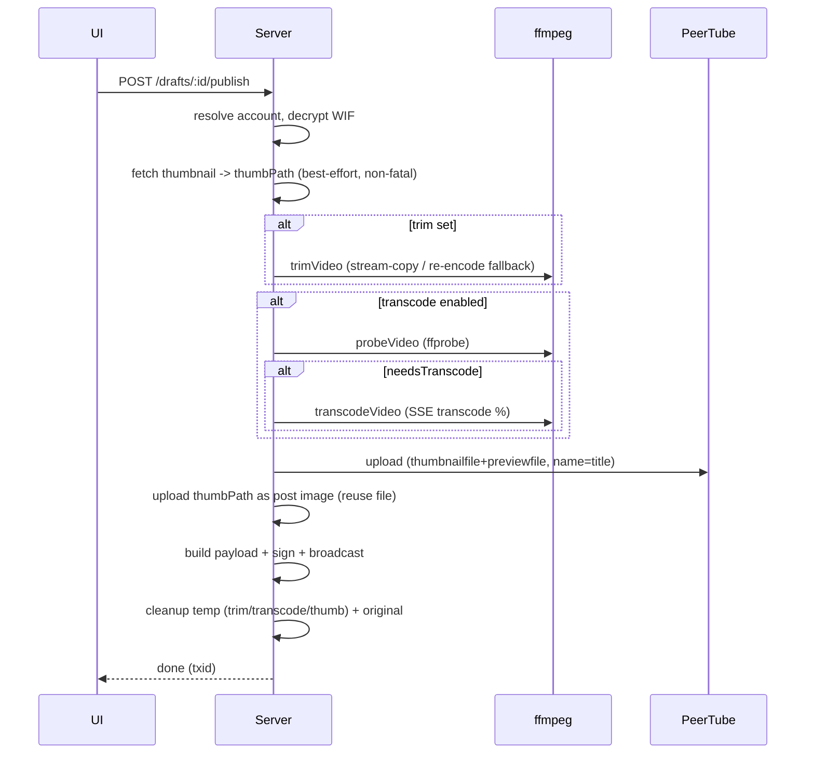

# Design — Pre-upload Transcoding & Thumbnail Attachment

## 1. Architecture Overview

This change extends the existing Bastyon publish pipeline (`docs/sdd/bastyon-integration/`) with two
server-side capabilities and one small client addition. No new runtime dependency is required: ffmpeg
is already used by `server/services/bastyon/trim.js`, and `form-data` is already used by
`server/services/bastyon/media.js`.

```
server/services/bastyon/transcode.js   ← NEW: ffprobe probe + needsTranscode + ffmpeg normalize
server/services/bastyon/media.js       ← + thumbnailfile/previewfile on both upload paths; name = title
server/services/bastyon/trim.js        ← (unchanged; transcode runs after trim)
server/routes/bastyon.js               ← publish orchestration: fetch thumbnail → trim → transcode → upload
server/services/bastyon/drafts.js      ← + transcode flag on the draft (default true)
client/src/views/bastyon.js            ← + "Normalize before upload" toggle; transcode progress row
```

The design mirrors the Bastyon desktop client's `pocketnet.gui/js/electron/transcoding2.js`
(normalization parameters) and `pocketnet.gui/js/peertube.js` (upload field names), adapted for a
2 vCPU server with a system ffmpeg.

## 2. Normalization Specification (transcode.js)

### 2.1 Probe

`probeVideo(filePath)` runs:

```
ffprobe -v error -print_format json -show_streams -show_format <file>
```

and returns:

| Field | Source |
| :--- | :--- |
| `width`, `height` | video stream |
| `frameRate` | `avg_frame_rate` (parsed as a fraction/float) |
| `videoBitrate` | video stream `bit_rate`, else `format.bit_rate`, else `null` |
| `audioBitrate` | audio stream `bit_rate`, else `null` |
| `videoCodec` | video stream `codec_name` |
| `audioCodec` | audio stream `codec_name` (undefined when there is no audio) |
| `durationSec` | `format.duration` (for progress %) |

### 2.2 Skip decision

`needsTranscode(probe)` returns true when **any** of the following hold:

```
videoCodec !== 'h264'
|| (audioCodec && !['aac', 'mp3'].includes(audioCodec))
|| height > 720
|| width > 1280
|| videoBitrate > 2600            // kbps
|| (audioBitrate && audioBitrate > 256)   // kbps
|| frameRate > 25
```

If `needsTranscode` is false, the file is uploaded as-is (REQ-TRX-3/4). Note this includes the
codec check, so a YouTube VP9/AV1/Opus download always gets normalized even at low resolution/bitrate.

### 2.3 ffmpeg invocation

`transcodeVideo(inputPath, { outputPath, onProgress, abortSignal })` spawns the **system** ffmpeg:

```
ffmpeg -y -i <input>
  -c:v libx264
  -c:a libmp3lame
  -vf scale=-2:min'(720,ih)'
  -qmin 25 -qmax 35
  -preset veryfast
  -b:v <targetVideoBitrate>k      # omitted when videoBitrate is null (CRF fallback)
  -b:a <targetAudioBitrate>k      # omitted when no audio / audioBitrate null
  -r <targetFps>
  -movflags +faststart
  -progress pipe:1 -nostats
  <output>.mp4
```

Targets (REQ-TRX-6):

```
targetVideoBitrate = min(2600, probe.videoBitrate)     // kbps
targetAudioBitrate = min(256,  probe.audioBitrate)     // kbps
targetFps          = min(25,   probe.frameRate)
```

| Parameter | Value | Origin |
| :--- | :--- | :--- |
| video codec | `libx264` | `transcoding2.js` |
| audio codec | `libmp3lame` | `transcoding2.js` |
| scale | `scale=-2:min'(720,ih)'` | `transcoding2.js` (single quotes are REQUIRED ffmpeg quoting for the comma in `min()`) |
| qmin/qmax | `25` / `35` | `transcoding2.js` |
| preset | `veryfast` | `transcoding2.js` |
| video bitrate | `min(2600, src)` kbps | `transcoding2.js` |
| audio bitrate | `min(256, src)` kbps | `transcoding2.js` |
| fps | `min(25, src)` | `transcoding2.js` |
| threads | **auto (omit `-threads`)** | adapted for 2 vCPU |
| faststart | `-movflags +faststart` | added for streaming/PeerTube |

### 2.4 2 vCPU / system-ffmpeg adaptation

The desktop client's `Bridge` refuses to transcode below 4 cores / 4 GB RAM and downloads ffmpeg via
`ffbinaries` (version 6.1). We deliberately drop both of those behaviors:

- **No core/RAM gate.** On a 2 vCPU server we omit `-threads` so x264 uses the available cores,
  keep `veryfast`, and accept longer encode time (REQ-TRX-8).
- **System binaries.** We reuse the `ffmpeg` already installed (as `trim.js` does) and check for
  `ffprobe` alongside it; no download (REQ-TRX-12).
- **No suboptimal-size rejection.** The reference errors when the output is larger than the input.
  For us size reduction is not the goal — normalization to H.264/MP3 and bitrate caps is. We log a
  warning when output > input but still use the transcoded file (deviation from `transcoding2.js`).

### 2.5 Progress & cancellation

`transcodeVideo` uses `spawn` (not `execFile`) so the process can be killed. `-progress pipe:1`
emits `out_time_ms` (falling back to `out_time_us`/`out_time`); percent =
`out_time_sec / durationSec * 100`. The publish route passes its `AbortSignal`; on abort it kills
the child and unlinks the partial output.

## 3. Thumbnail Attachment (media.js)

### 3.1 Field names

PeerTube's upload endpoints accept two image fields; the desktop client sets both to the same file
(`js/peertube.js` `upload` / `initResumableUpload`):

```
thumbnailfile  → cover / poster (large)
previewfile    → preview (small)
```

We do the same, passing the fetched YouTube thumbnail file as-is (no resize; PeerTube derives sizes).

### 3.2 API surface

`uploadToPeertube(filePath, account, host, onProgress, { thumbnailPath = null, title = '' } = {})`
and `uploadVideo(filePath, account, host, onProgress, opts = {})` gain the two new options.

- **Simple upload (≤ 50 MB):** append to the existing `form-data`:
  `thumbnailfile` and `previewfile` (both `createReadStream(thumbnailPath)`, content type
  `image/jpeg`/`image/png` via the existing `guessMime`).
- **Resumable upload (> 50 MB):** switch the init request from `URLSearchParams` to `form-data`
  (the desktop client sends multipart), keeping `filename`, `name`, `channelId`, `privacy` and the
  `X-Upload-Content-Length` / `X-Upload-Content-Type` headers, and appending `thumbnailfile` +
  `previewfile`. The chunk PUTs and GET-range resync are unchanged.

### 3.3 Video title

`uniqueName` (random) is replaced by the draft title (trimmed), with a fallback to the source title
or the previous generated name (REQ-TIT-1/2).

## 4. Publish Pipeline (routes/bastyon.js)

Order change: the thumbnail must be fetched **before** upload so it can be attached in the same
request, and transcode runs after trim (trim shortens the input before the expensive re-encode).



- On transcode failure the draft returns to `draft`/`failed` with the file retained (REQ-TRX-13),
  matching the existing trim failure path.
- On thumbnail failure, publishing continues without the cover (REQ-THM-6).

## 5. Data Model Changes

Draft (`data/bastyon-drafts.json`) gains one field:

```jsonc
{
  // ...existing fields...
  "transcode": true        // normalize before upload (default true)
}
```

`PUT /api/bastyon/drafts/:id` accepts `transcode` (boolean). No new thumbnail field is needed — the
existing `thumbnailUrl` is fetched at publish time and the local path is a transient publish value.

## 6. Porting Map (reference → this repo)

| Reference | This repo | Key behavior |
| :--- | :--- | :--- |
| `transcoding2.js` `getVideoProbe` | `transcode.js` `probeVideo` | ffprobe stream/format extraction |
| `transcoding2.js` `spawnFfmpeg` | `transcode.js` `transcodeVideo` | libx264 / libmp3lame / `scale=-2:min(720,ih)` / qmin·qmax / veryfast / `min(2600,·)` / `min(256,·)` / `min(25,·)` |
| `transcoding2.js` `Bridge.Requirements` | dropped | no 4-core / 4 GB gate (2 vCPU server) |
| `transcoding2.js` `checkSuboptimalResult` | dropped → warning | size reduction is not the goal |
| `peertube.js` `upload` / `initResumableUpload` | `media.js` | `thumbnailfile` + `previewfile`, multipart resumable init |
| `peertube.js` `update` (PUT) | optional follow-up | post-publish cover change |

## 7. Edge Cases

- **No audio stream** — skip `-c:a`/`-b:a`; the MP4 has video only.
- **Unknown bitrate** — stream → container fallback → CRF (no `-b:v`).
- **Vertical videos** — the desktop client rejects them (`VERTICAL_VIDEO_NOT_SUPPORTED`); we do **not**
  reject — `scale=-2:min(720,ih)` handles them, and PeerTube accepts portrait video.
- **Thumbnail URL missing/expired** — non-fatal; publish without cover.
- **ffprobe missing but ffmpeg present** — clear error before transcoding (REQ-TRX-12).
- **Insufficient disk** — abort before transcode (REQ-TRX-10).
